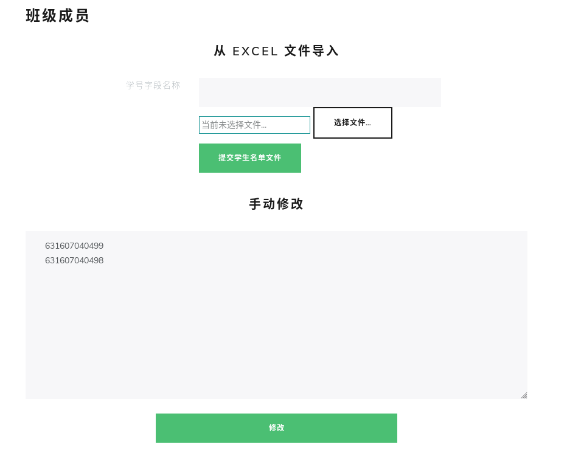
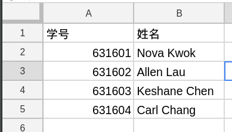

# 班级

## 创建班级

教师在登录后可以在"班级"标签栏创建班级。

## 录入班级成员

### 手动录入

在创建班级后，将所有的学号复制到文本框中，点击修改即可完成班级成员的手动录入。

### 自动录入

YunLoad 提供通过 Excel 自动录入班级成员的功能，目前此功能还在测试当中，需要 Excel 文档有类似如下的格式：

选择文件后在文本框中输入包含学号的列（本例中为"学号"），点击"提交学生名单文件"即可。

**此功能目前还在测试中，如果遇到导入的问题请尝试手动录入。**
