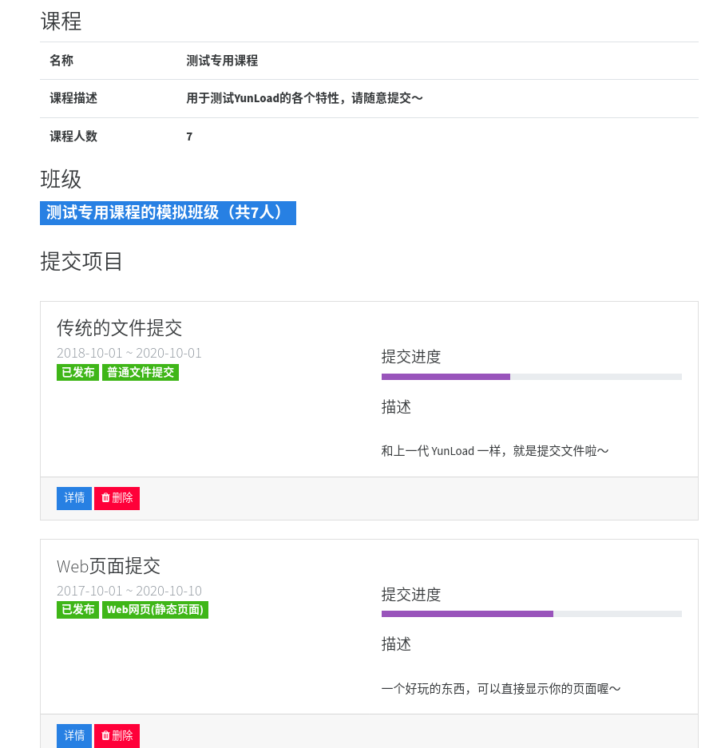

# 课程

课程和提交项目是一个一对多的关系，目前 YunLoad 平台中，一个课程旗下可以有多个提交项目。

## 创建课程

教师在登录后可以在"课程"标签栏创建课程。

## 绑定班级

如果已经创建好了课程，需要绑定到对应的班级上的话，需要进入课程之后点击 "修改课程信息"，进行班级的绑定与解绑。

## 课程提交管理

在每个「课程」下，可以直接看到对应「提交项目」的进度等信息：

