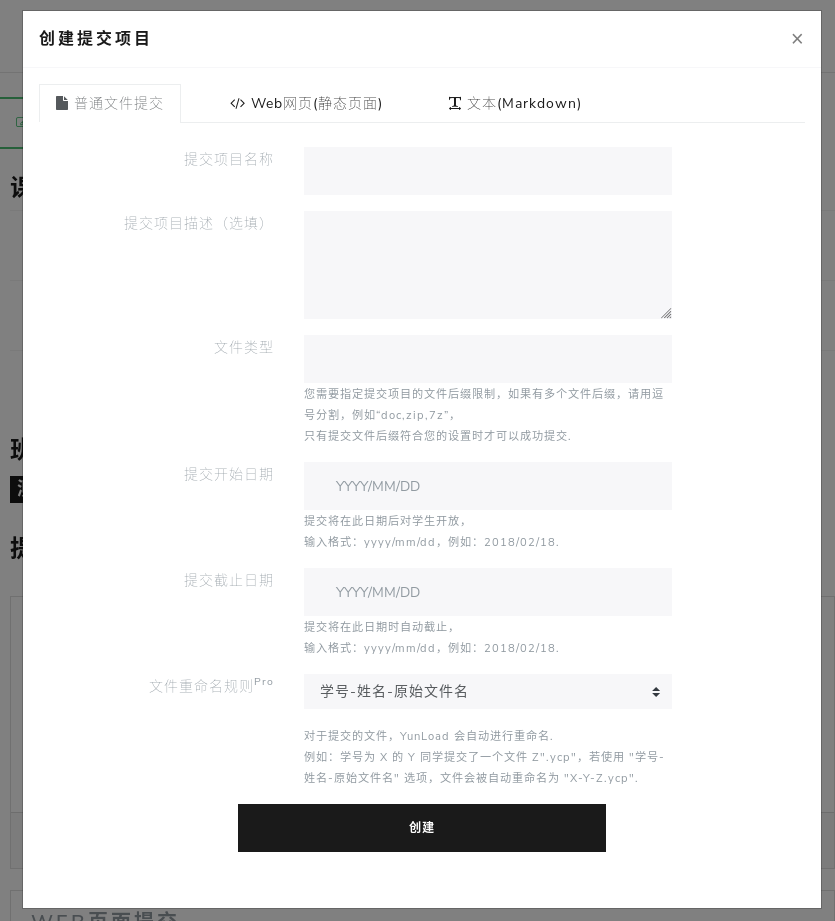
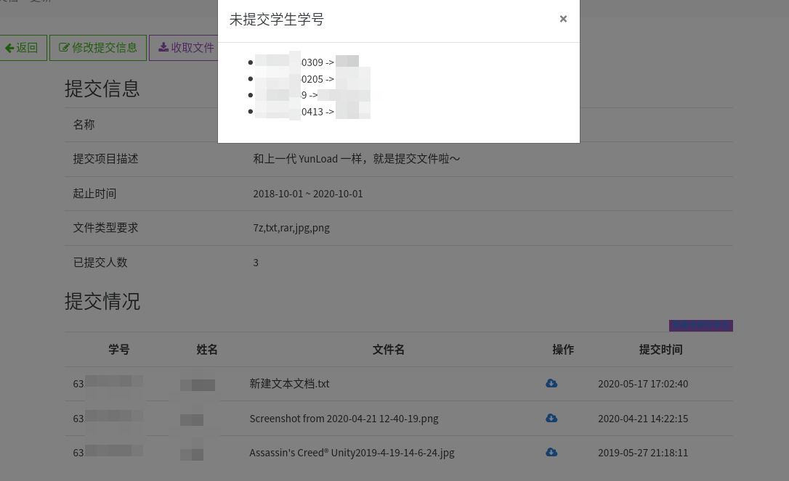

# 提交项目

## 创建提交项目

对于提交项目的创建，目前 YunLoad 支持以下几种不同类似的提交以应对不同的需求：

- 普通文件提交（包含按照规则自动重命名的规则）
- Web 页面提交，相关信息参考 [《YunLoad 静态页面托管功能》](https://blog.yunload.org/yunload-static-hosting/)
- Markdown 文本提交，相关信息参考 [《YunLoad 增加文本提交功能》](https://blog.yunload.org/yunload-add-text-submission-function/)

## 提交项目信息

在每个提交项目中，可以很容易地了解到对应提交项目的提交人数等信息：

::: tip
如果您有更多的需求，可以联系我们进行定制。
:::
